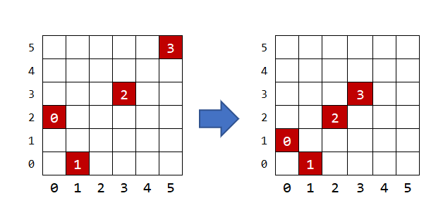
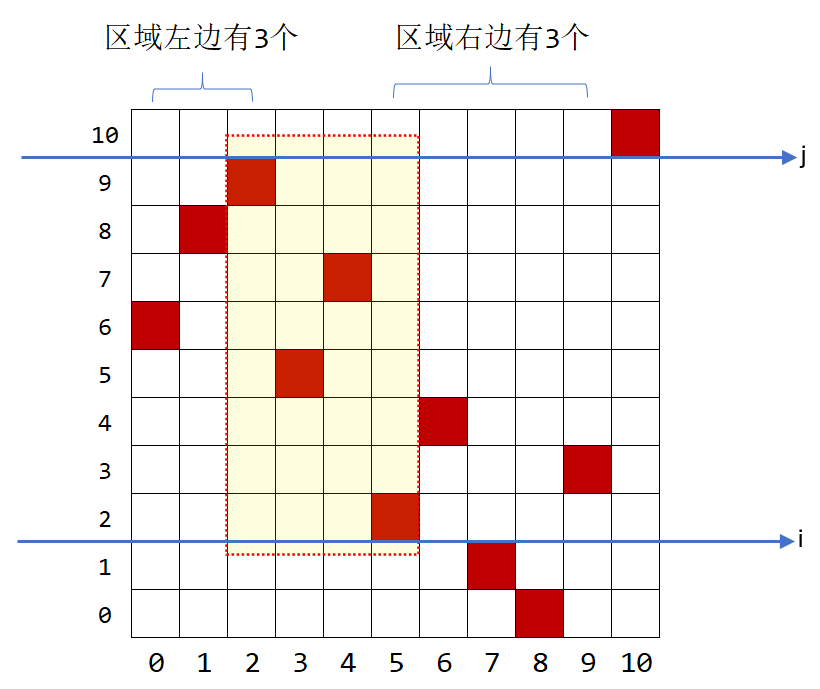
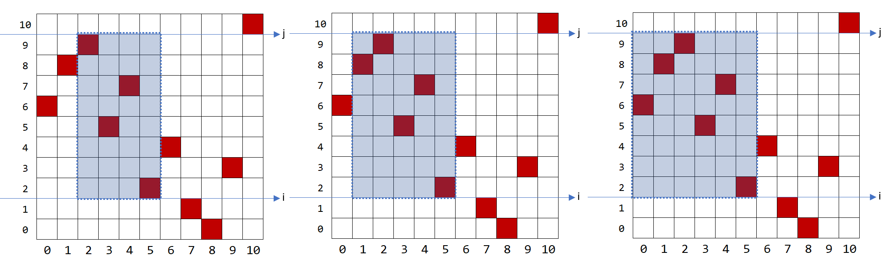
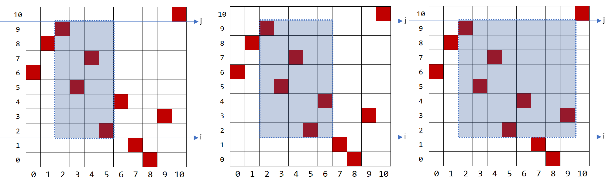
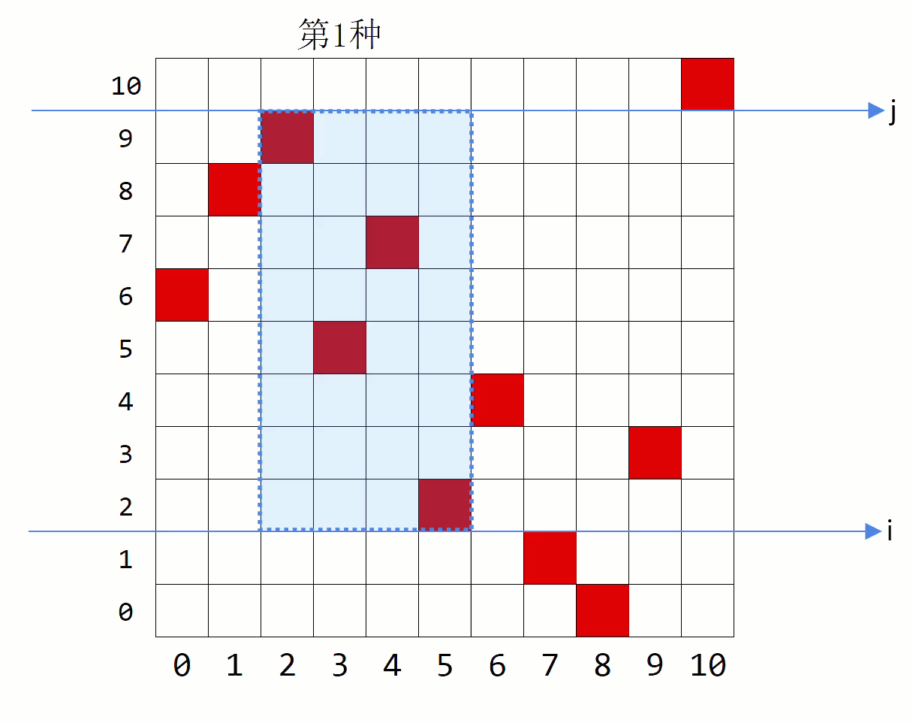

# 乘法原理解决Rectangular Pasture(Silver)

## 题目来源

[USACO 2020 December Contest, Silver Problem 2. Rectangular Pasture](http://www.usaco.org/index.php?page=viewproblem2&cpid=1063)

## 思路

### 离散化(Discretization)

题目明确所有坐标在$0…10^9$范围内，而且所有$x$坐标各不相同，所有$y$ 坐标各不相同，且仅有$N$个坐标。$N$最多$2500$。因此可以想到离散化，把巨大的坐标压缩成$N \times N$的方格，移除空行空列。保证每行每列都有牛。


```cpp
vector<Point> P(N);
for (int i = 0; i <= N - 1; ++i)
{
    int x, y;
    cin >> x >> y;
    P[i] = make_pair(x, y);
}

//>>>>>>>>>>>>>>>>>>>>>>>>>>>>>>>>>>>>>>>>>>>>>>>>>>>>>离散化,坐标0 ~ (N-1)
sort(P.begin(), P.end());
for (int i = 0; i <= N - 1; ++i)
    P[i].first = i ;

sort(P.begin(), P.end(), [](const Point & p, const Point & q) 
{
    return p.second < q.second;
});

for (int i = 0; i <= N - 1; ++i)
    P[i].second = i;
```

### 最小矩形
无论矩形是怎样，只有围住的牛是一样的就是一样的，如下图。因此先考虑最小矩形就行了。


### 最小矩形的上下边
观察最小矩形的上下边$i,j$:
- 离散后，每行、列都有牛。
- 每不同$i,j$都会贡献子集的数量。
- 暴力每个$i,j$，累加当前$i,j$内子集的数量就行了。


### 最小矩形的上下边内的子集的数量
如下图，观察行$i,j$内的最小矩形:
- 上下边必有一头牛。
- 这个矩形左边有3个牛(包括边那头牛)
- 这个矩形右边有3个牛(包括边那头牛)



- 左边可以有3中不同的矩形，可向`左`拓展：


- 有边可以有3中不同的矩形，可向`右`拓展：


- `左+右`同时考虑，根据乘法原理。共有$3 \times 3 =9$ 种不同的矩形，如下


### 方法一：前缀和快速计算左右牛的数量

```cpp
//cowCnt[i][j]表示[0,0] - [i,j]区域内的奶牛数
vector<vector<int>> cowCnt = vector<vector<int>>(N, vector<int>(N, 0));
//>>>>>>>>>>>>>>>>>>>>>>>>>>>>>>>>>>>>>>>>>>>>>>>>>>>>>前缀和
for (int i = 0; i <= N - 1; ++i)
    cowCnt[P[i].first][P[i].second] = 1;      //如当前x,y坐标下有牛，cowCnt[x][y]=1;

for (int y = 1; y <= N - 1; ++y)
    cowCnt[0][y] += cowCnt[0][y-1];

for (int x = 1; x <= N - 1; ++x)
    cowCnt[x][0] += cowCnt[x-1][0];

//[0,0] - [i,j]区域内的奶牛数
for (int x = 1; x <= N-1; ++x)
    for (int y = 1; y <= N-1; ++y)
        cowCnt[x][y] += (cowCnt[x - 1][y] + cowCnt[x][y - 1] - cowCnt[x - 1][y - 1]);

//<<<<<<<<<<<<<<<<<<<<<<<<<<<<<<<<<<<<<<<<<<<<<<<<<<<<<

//O(1)计算[x1,y1] - [x2,y2]区域内的牛数
auto getAreaCnt = [&](int x1, int y1, int x2, int y2)
{
    if(x1>0 && y1>0)
        return cowCnt[x2][y2] - cowCnt[x2][y1 - 1] - cowCnt[x1 - 1][y2] + cowCnt[x1 - 1][y1 - 1];
    else if(x1==0 && y1>0)
        return cowCnt[x2][y2] - cowCnt[x2][y1 - 1];
    else if(x1>0 && y1==0)
        return cowCnt[x2][y2] - cowCnt[x1-1][y2];                
    else 
        return cowCnt[x2][y2];
};
```

## 计算答案

以上思路没算上空集，最后要注意的是因为空集也算，所以答案要加上1。

```cpp
ill answer = 0;

for (int i = 0; i <= N - 1; ++i)
{
    for (int j = i; j <= N - 1; ++j)
    {
        int x1 = min(P[i].first, P[j].first);
        int x2 = max(P[i].first, P[j].first);
        answer += getAreaCnt(0, i, x1, j) * getAreaCnt(x2, i, N - 1, j);        //第i行~j行之间，牛的子集数量
    }
}
cout << answer + 1 << "\n";

```

## 完整代码

```cpp
#ifndef LOCAL_DEBUG
#define NDEBUG //ban assert when submit to online judge
#endif

#ifdef LOCAL_DEBUG
#include <chrono>
#endif

#include <bits/stdc++.h>

#define FastIO                        \
    ios_base::sync_with_stdio(false); \
    std::cin.tie(nullptr);            \
    std::cout.tie(nullptr)

using namespace std;

using ill = long long;
using Point = pair<int, int>;

class solution
{

  public:
    void solve()
    {
        int N;
        cin >> N;

        //cowCnt[i][j]表示[0,0] - [i,j]区域内的奶牛数
        vector<vector<int>> cowCnt = vector<vector<int>>(N, vector<int>(N, 0));

        vector<Point> P(N);
        for (int i = 0; i <= N - 1; ++i)
        {
            int x, y;
            cin >> x >> y;
            P[i] = make_pair(x, y);
        }

        //>>>>>>>>>>>>>>>>>>>>>>>>>>>>>>>>>>>>>>>>>>>>>>>>>>>>>离散化,坐标0 ~ (N-1)
        sort(P.begin(), P.end());
        for (int i = 0; i <= N - 1; ++i)
            P[i].first = i ;

        sort(P.begin(), P.end(), [](const Point & p, const Point & q) 
        {
            return p.second < q.second;
        });

        for (int i = 0; i <= N - 1; ++i)
            P[i].second = i;
        
        //<<<<<<<<<<<<<<<<<<<<<<<<<<<<<<<<<<<<<<<<<<<<<<<<<<<<<

        //>>>>>>>>>>>>>>>>>>>>>>>>>>>>>>>>>>>>>>>>>>>>>>>>>>>>>前缀和
        for (int i = 0; i <= N - 1; ++i)
            cowCnt[P[i].first][P[i].second] = 1;      //如当前x,y坐标下有牛，cowCnt[x][y]=1;

        for (int y = 1; y <= N - 1; ++y)
            cowCnt[0][y] += cowCnt[0][y-1];

        for (int x = 1; x <= N - 1; ++x)
            cowCnt[x][0] += cowCnt[x-1][0];

        //[0,0] - [i,j]区域内的奶牛数
        for (int x = 1; x <= N-1; ++x)
            for (int y = 1; y <= N-1; ++y)
                cowCnt[x][y] += (cowCnt[x - 1][y] + cowCnt[x][y - 1] - cowCnt[x - 1][y - 1]);

        //<<<<<<<<<<<<<<<<<<<<<<<<<<<<<<<<<<<<<<<<<<<<<<<<<<<<<

        //O(1)计算[x1,y1] - [x2,y2]区域内的牛数
        auto getAreaCnt = [&](int x1, int y1, int x2, int y2)
        {
            if(x1>0 && y1>0)
                return cowCnt[x2][y2] - cowCnt[x2][y1 - 1] - cowCnt[x1 - 1][y2] + cowCnt[x1 - 1][y1 - 1];
            else if(x1==0 && y1>0)
                return cowCnt[x2][y2] - cowCnt[x2][y1 - 1];
            else if(x1>0 && y1==0)
                return cowCnt[x2][y2] - cowCnt[x1-1][y2];                
            else 
                return cowCnt[x2][y2];
        };

        ill answer = 0;

        for (int i = 0; i <= N - 1; ++i)
        {
            for (int j = i; j <= N - 1; ++j)
            {
                int x1 = min(P[i].first, P[j].first);
                int x2 = max(P[i].first, P[j].first);
                answer += getAreaCnt(0, i, x1, j) * getAreaCnt(x2, i, N - 1, j);        //第i行~j行之间，牛的子集数量
            }
        }
        cout << answer + 1 << "\n";
    }
};

signed main()
{
    FastIO;

#ifdef LOCAL_DEBUG
    freopen("RectangularPasture.in", "r", stdin);
    //freopen("RectangularPasture.out", "w", stdout);
    auto startTime = chrono::high_resolution_clock::now();
#endif

    solution sln1;
    sln1.solve();
    cout.flush();

#ifdef LOCAL_DEBUG
    cerr << "Execution time: "
         << chrono::duration_cast<chrono::milliseconds>(chrono::high_resolution_clock::now() - startTime).count()
         << " ms\n";
#endif

    return 0;
}
```

参考
<https://zh.wikipedia.org/wiki/%E4%B9%98%E6%B3%95%E5%8E%9F%E7%90%86>
<https://en.wikipedia.org/wiki/Prefix_sum>