# LCA算法之倍增法

***
## 问题
一个有$n$个节点的树,求任意两点$u,v$的最近公共祖先$lca$（Lowest common ancestor）

## 最近公共祖先定义

在一棵没有环的树上，每个节点肯定有其父亲节点和祖先节点，而最近公共祖先，就是两个节点在这棵树上**深度最大**的**公共**的**祖先**节点。
换句话说，就是两个点在这棵树上距离最近的公共祖先节点。

所以LCA主要是用来处理当两个点仅有唯一一条确定的最短路径时的路径。

<https://en.wikipedia.org/wiki/Lowest_common_ancestor>
<https://zh.wikipedia.org/wiki/最近公共祖先_(图论)>


以下图：

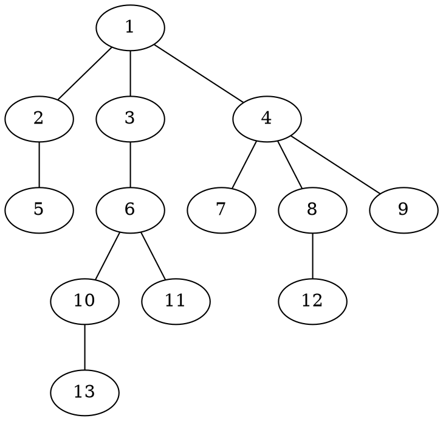

例如：
$LCA(13,11)=6$
$LCA(10,11)=6$
$LCA(5,11)=1$
$LCA(7,4)=4$  （**<font color=DarkRed>注意：节点也是自己的祖先</font>**）


## 朴素算法

$u=13,v=12,LCA(u,v)=?$

求$LCA(13,12)=?$

1. **<font color=DarkRed>计算节点深度：</font>** 从根节点深度搜索一次树，计算每一个节点的深度$depth[i]$，时间复杂度$O(n)$。

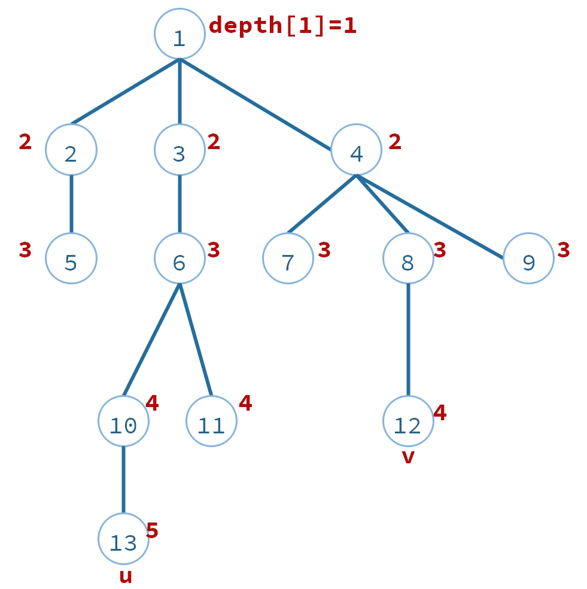

2. **<font color=DarkRed>平衡两点深度：</font>** 如果$depth[u] \neq depth[v]$，把深度比较大深的往上移动，使得$depth[u] = depth[v]$。时间复杂度$O(\mid p-q \mid)$,期中p，q表示这两个节点的深度。

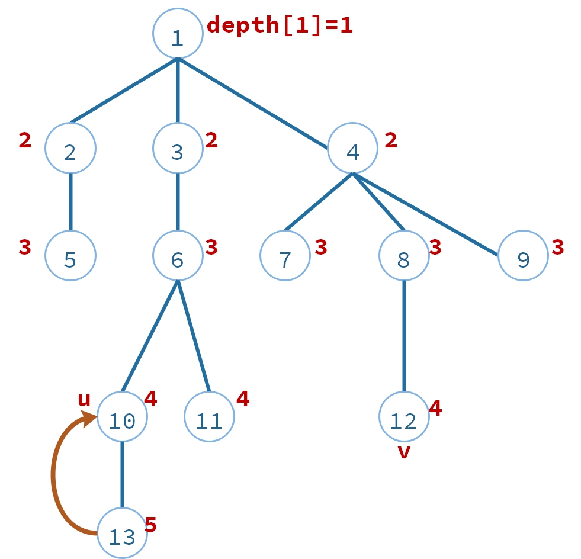

把$u=13$ 这个点往上移动(往父节)，使得$u=10$。此时$depth[12] = 4,depth[12] = 4$。

3. **<font color=DarkRed>同时移动两点，直到相同：</font>** $u$,$v$每次同时往上移动一步，直到$u=v$,这时候就是LCA的答案，时间复杂度：$O(n)$ 如下图：

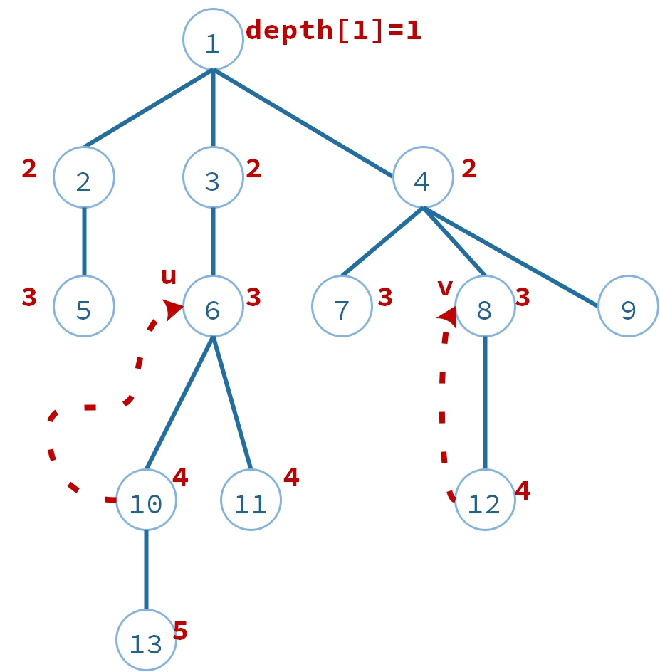 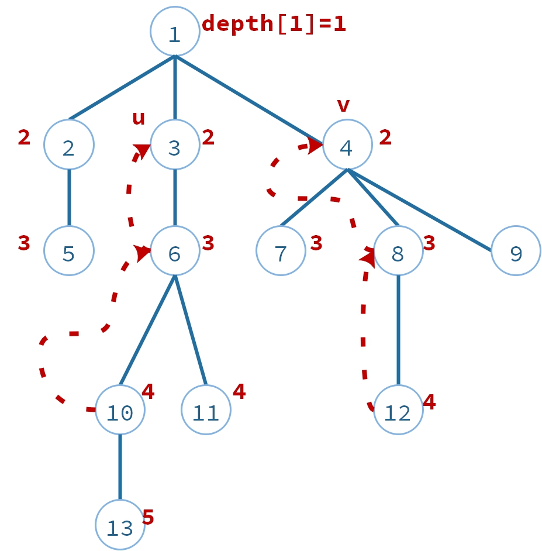 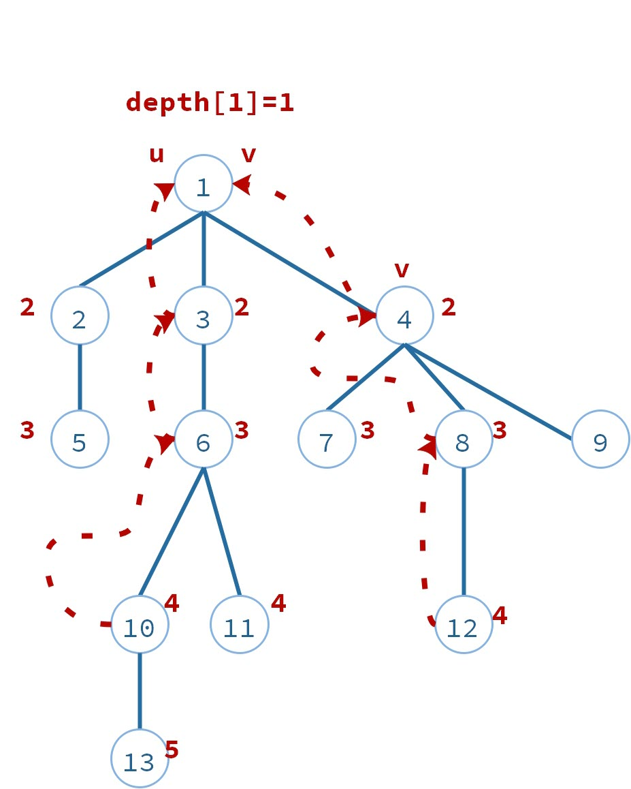

## 倍增算法

#### **<font color=DarkRed>思路</font>**


以上第2、3步骤，每次都移动一步。时间复杂度$O(\mid p-q \mid) + O(n)$。

还可以快一点。一口气移动m步。

1. 预先计算好每个节点的上一辈祖先，上两辈祖先，上四辈祖先，上八辈祖先，....，上$2^k$辈祖先，$k=\log_2(n)$;
2. 二分查找LCA;
2.1 辈分太高，祖先相等或超出根节点，缩减一半。
2.2 辈分太低，祖先是两个不同节点，未到达共同祖先，移动节点。
2.2 直到找到第一个祖先不重叠的的节点

#### **<font color=DarkRed>说明</font>**

1. 寻找u,v的LCA

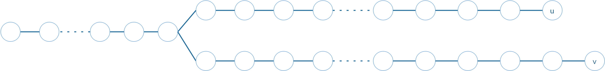

2. 移动v，使得u、v深度相同
3. 开始跳跃
3.1 跳跃最大处：$2^{k+1}$
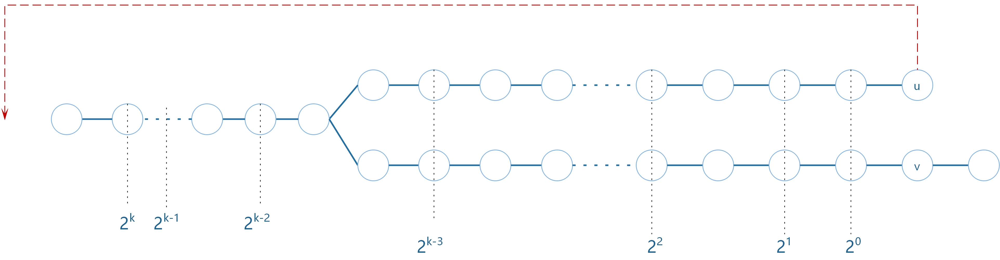
3.2 发现祖先相同，太多，缩减一半。$2^{k}$
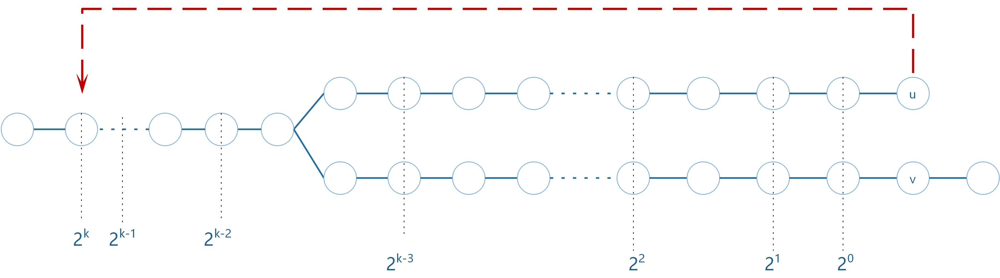
3.3 祖先相同，还是太多，重复缩减一半。$2^{k-1}...$
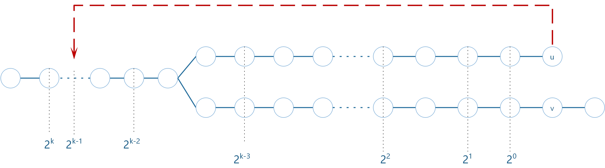
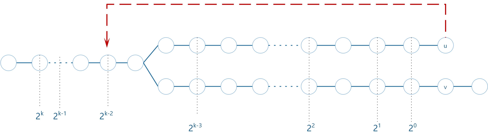
3.4 发现祖先不同，停止缩减。$2^{k-3}$
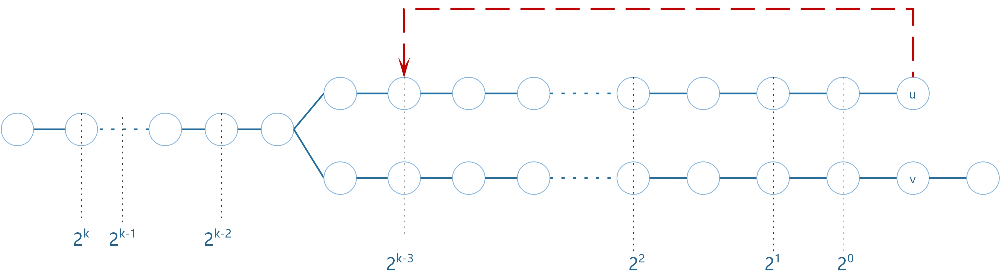
3.5 移动u,v到这个位置，重复跳跃。前面已经跳了$3$次。此刻从$2^{k-3}$开始跳跃
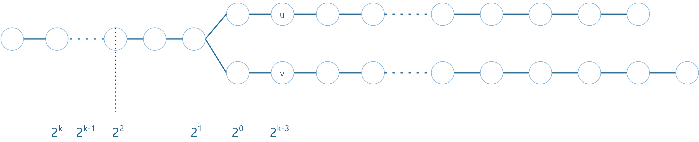
3.6不断重复跳跃，可以跳到离u，v最远，且不同的祖先
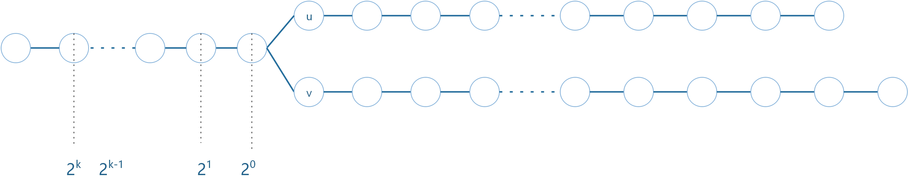
3.7上一步(3.6)的父亲就是LCA

#### **<font color=DarkRed>原理</font>**

理论上 u 的所有祖先都可以根据ancestors数组多次跳转得到，因为理论上任意证整数都可以由$2^n$累加构成，例如：

$log_2(69)=6.10852$

$ 69 二进制： 01000101 = 2^6+2^2+2^0$

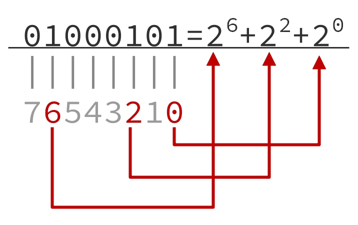


贪心法：

1. $  \color{Red}{2^7} > 69$
1. $  {2^6} < 69$ 
2. $  2^6+\color{Red}{2^5} > 69$ 
3. $  2^6+\color{Red}{2^4} > 69$
4. $  2^6+\color{Red}{2^3} > 69$
5. $  2^6+\color{Red}{2^2} < 69$
6. $  2^6+2^2 + \color{Red}{2^1} > 69$
7. $  \color{blue}{2^6+2^2 + 2^0 = 69}$
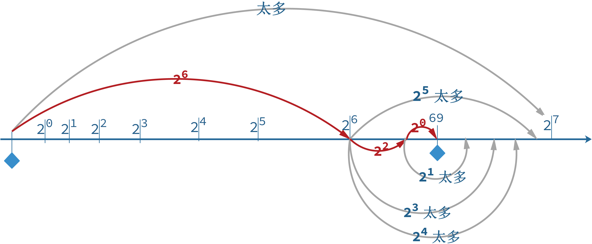

$  01001111 (79)=2^6+2^3+2^2+2^1+2^0$

#### **<font color=DarkRed>代码</font>**

1. 变量声明和初始化

```c++
private:
int n;                              //节点的数量
int root;                           //根节点
int maxUpStep;                      //最大跳跃的步数=log2(n)
vector<int> depth;                  //每个节点的深度depth[2]=1,表示节点2的深度是1
vector<int> visited;                //深度搜索访问过的节点
vector<vector<int>> ancestors;      //ancestors[i][j]表示i节点往上2^j个祖先

public:    
vector<vector<int>> tree;

LCA(int p_n)
{
    this->n=p_n;
    maxUpStep = lg2(n);

    tree.assign(n + 1, vector<int>());
    ancestors.assign(n + 1, vector<int>(maxUpStep+1, 0));

    depth.assign(n + 1, 0);
    visited.assign(n + 1, 0);
}
```

2. 记录各节点i的深度depth[i]。dfs一遍即可O(N)。

```c++
void dfsDepth(int curr)
{
    visited[curr] = 1;
    //遍历curr的子节点
    for(auto next:tree[curr])
    {
        ancestors[next][0] = curr;
        depth[next] = depth[curr] + 1;
        if (visited[next] == 0)
            dfsDepth(next);
    }
}
```

3. <font color=DarkRed>预处理倍增数组</font>，$ancestors[i][j]$表示节点$i$往上(往根的方向)跳$2^j$步的祖先节点编号。0表示不存在节点，也就是跳过根了。$ancestors[i][0]$是节点$i$的父节点标号。
递推关系：$ancestors[i][j] = ancestors[ancestors[i][j-1]][j-1]$

因为：$2^j=2^{j-1}+2^{j-1}$

所以：
$ancestors[i][0] = parent[v]$
$ancestors[i][1] = ancestors[ancestors[i][0]][0]$
$ancestors[i][2] = ancestors[ancestors[i][1]][1]$
$ancestors[i][3] = ancestors[ancestors[i][2]][2]$
$ancestors[i][j] = ancestors[ancestors[i][j-1]][j-1]$

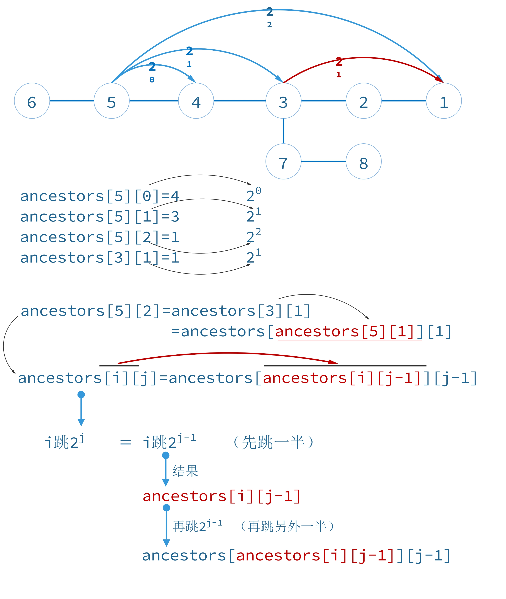

原理：$2^j=2^{j-1}+2^{j-1}$

```c++
void setAncestors()
{
    for (int j = 1; j <= maxUpStep; ++j)
        for (int i = 1; i <= n; ++i)
            ancestors[i][j] = ancestors[ancestors[i][j - 1]][j - 1];
}
```

4. 查找u,v的LCA
```c++
int lca(int u, int v)
{
    if (depth[u] < depth[v])
        swap(u, v);

    //设置同等深度
    for (int b = maxUpStep; b >= 0; --b)
        if (depth[ancestors[u][b]] >= depth[v])
            u = ancestors[u][b];
    
    if (u == 0)
        return root;
    else if (u == v)
        return u;

    //往上跳跃
    for (int b = maxUpStep; b >= 0; --b)
    {
        if (ancestors[u][b] != ancestors[v][b])
        {
            u = ancestors[u][b];
            v = ancestors[v][b];
        }
    }
    return ancestors[u][0];
}
```

5.快速计算$log_2(n)$,位运算：$(1<<i) = 2^i$
```c++
int lg2(int n)
{
    int i = 0;
    while ((1<<i) <= n)             //(1<<i) = 2^i
        ++i;

    return i-1;
}
```

#### **<font color=DarkRed>总结</font>**
- 倍增算法（英文名：Binary Lifting）是在线算法，适合查询数量比较少的情况。时间复杂度在$O(log(n))$ ~ $O(n*log(n))$之间。
- 还有一种离线算法Tarjan，适合查询数量比较多的情况。

参考

<https://zhyack.github.io/posts/2015_12_22_LCA-Binary-Lifting-Note.html>
<http://www.csie.ntnu.edu.tw/~u91029/Tree.html#5>
<https://www.geeksforgeeks.org/lca-in-a-tree-using-binary-lifting-technique/>
<https://cp-algorithms.com/graph/lca_binary_lifting.html>
<https://codeforces.com/blog/entry/22325>
<https://iq.opengenus.org/binary-lifting-k-th-ancestor-lowest-common-ancestor/>
<https://acmcairoscience.wordpress.com/2015/04/07/lowest-common-ancestor-finding-of-o-log-n-binary-lifting-method/>
<http://rahul-walkar.blogspot.com/2017/07/lca-binary-lifting-and-hld.html>

题目

Nearest Common Ancestors
<http://poj.org/problem?id=1330>

LCA - Lowest Common Ancestor
<https://www.spoj.com/problems/LCA/>

DISQUERY - Distance Query
<https://www.spoj.com/problems/DISQUERY/>

Tourists
<https://open.kattis.com/problems/tourists>

A and B and Lecture Rooms
<https://codeforces.com/contest/519/problem/E>

Lynyrd Skynyrd (倍增思想)
<https://codeforces.com/contest/1143/problem/E>

题目清单
<https://a2oj.com/category?ID=208>
<https://codeforces.com/blog/entry/43917>
<https://cp-algorithms.com/graph/lca.html>