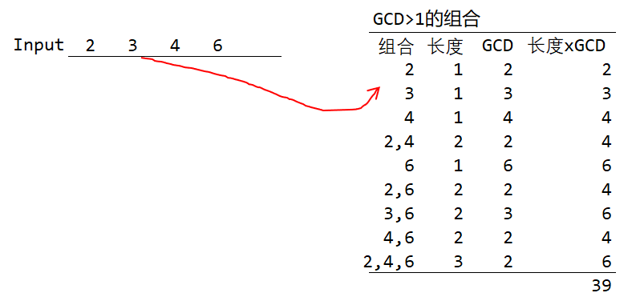
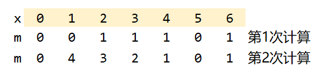

# 839D Winter is here
***
https://codeforces.com/contest/839/problem/D


## 分析

### 概述

观察以下图形



$gcd=2$的组合$\{2\},\{2,4\},\{2,6\},\{4,6\},\{2,4,6\}$
长度：$1,2,2,2,3$

$gcd=3$的组合
$\{3\},\{3,6\}$
长度：$1,2$

$gcd=4$的组合
$\{4\}$
长度：$1$


$gcd=5$的组合
$\{\}$
长度：$0$

$gcd=6$的组合
$\{6\}$
长度：$1$

因此：
$ans = 2 \times 1 +2 \times 2 + 2 \times 2 +2 \times 2 + 2 \times 3 + 3 \times 1 + 3 \times 2 + 4 \times 1 + 5 \times 0 + 6 \times 1 $ 
&nbsp;&nbsp;&nbsp;&nbsp;&nbsp;&nbsp;&nbsp;&nbsp;$=39$

### 进一步观察得出规律
$gcd[i]$ 表示 $gcd=i$ 的全部的组合
- $gcd[i]$ 如有多个组合,必然是$i$或$i$的倍数，例如：$2,4,6$
- $gcd[i]$ 如仅一个组合,必然是仅有$i$，无倍数，例如：$4$
- $gcd[i]$ 无组合,$i$不存在input数组，例如：$5$

### 倍数很关键
用数组$m[x]$表示输入的数据中，$x$的倍数有多少个。含$x$，$m$是$multiple$倍数的意思
```c++
vector<int> m(maxA, 0); //m[x] 能整除数字x有多少个，maxA=1e6
for (int i = 1, x; i <= n; ++i)
{
    cin >> x;
    ++m[x]; //数字x有多少个
    mx = max(mx, x);
}

//数字x的倍数有多少个,含x
for (int x = 1; x <= mx; ++x)
    for (int j = x + x; j <= mx; j += x)
        m[x] += m[j];
```
$m[i]$的值


### 进一步
设：$$f(i)=\sum_{S\subseteq A}^{GCD(S)=i}|S|$$

$f(i)$是$GCD==i$所有的集合长度的累加结果，
例如$f(2)$的集合有：$\{2\},\{2,4\},\{2,6\},\{4,6\},\{2,4,6\}$
长度：分别是 $1,2,2,2,3$
$f(2)=1+2+2+2+3=10$


则：($x=1e6$)
$ans=1\times f(1)+2\times f(2) + 3\times f(3)+...+x\times f(x)$

既：$ans=\sum_{i=2}^{10^6} (i \times f(i))$

### 如何求$f(i)?$

$f(2)$有集合：$\{2\},\{2,4\},\{2,6\},\{4,6\},\{2,4,6\}$  ~~{4},{6}~~
发现是2,4,6这3个数的全部的组合移除组合4,6，既：$1\times C_3^1+2\times C_3^2+3\times C_3^3 - f(4) - f(6)$ 
$2\times f(2)=2\times (12-1-1)=20$

假设$i$的倍数有$n$个，则
$$f(i)=(\sum_{i}^{n}i\times C_n^i)-f(2\times i) - f(3\times i) ... - f(k\times i)$$
期中$k\times i <=$ 最大的数

考虑以下组合公式公式成立：
$$1\times C_n^1 + 2\times C_n^2+3\times C_n^3+...+n\times C_n^n=n\times 2^{n-1}$$
则：
$$f(i)=(n\times 2^{n-1})-f(2\times i) - f(3\times i) ... - f(k\times i)$$
期中$k\times i <=$ 最大的数

$$f(i)=(n\times 2^{n-1})-\sum_{k=2}^{k*i\leq 最大的数}f(k\times i)$$
期中$n$的代表：$i$的倍数有$n$个

因为$f(i)$需要减去交大的$f(k\times i)$,因此需要从最大的$i$开始计算$f(i)$

```c++
int ans = 0;
for (int i = mx; i >= 2; --i)
{
    f[i] = 1ll * a[i] * pow2[a[i] - 1] % mod;
    for (int j = i + i; j <= mx; j += i)
        f[i] = (f[i] - f[j]) % mod;
    ans = (ans + 1ll * f[i] * i) % mod;
}
cout << (ans*1ll + mod*1ll) % mod << "\n";
```