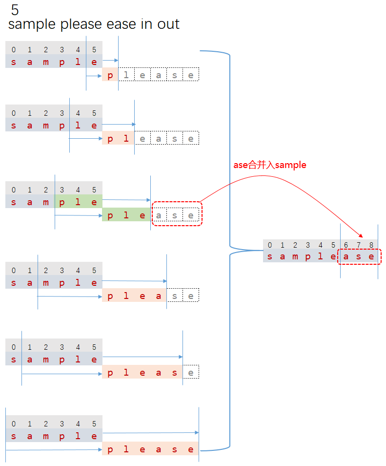

# 1200E. Compress Words 

## 来源

https://codeforces.com/contest/1200/problem/E

## 题意

给定n（$1\leq n \leq 10^5$）个 words ：

- 每个word使用空格分开
- 每个word非空
- 每个word由大小写字母+数值组成： ('A', 'B', ..., 'Z', 'a', 'b', ..., 'z', '0', '1', ..., '9') 
- 全部word总长度不超过$10^6$

求合并word的结果，合并规则

- 移除空格
- 如果第2个word的最长前缀和第1个word的后缀相同，则移除

例如"sample" 和 "please" ，合并就变成："samplease".

## Examples

||
|:----------------------------------|
| **input**                         |
| 5 <br>I want to order pizza       |
| **output**                        |
| Iwantorderpizza                   |

||
|:----------------------------------|
| **input**                         |
| 5 <br>sample please ease in out   |
| **output**                        |
| sampleaseinout                    |


## 解题思路：hash

1. 第1个word计算哈希存储到数组ansHash[i]；
2. 循环第2个word的字符，计算前缀哈希，根据第1步的数组O(1)计算后缀哈希
3. 如果哈希值符合，表示第1个word的后缀和第2个word的前缀一样，记录位置pos
4. 第3部循环查找，一直找到最大的pos，注意不要超过第1个word长度和第2个word的长度
5. 最大的pos之后的字符组成的子串（substring）和第1个word合并
6. 最大的pos之后的字符组成的子串（substring）计算哈希添加到数组ansHash[i]


### 第2个word的前缀和第1个word的后缀比较


### 第3个word的前缀和第1、2合并之后word的后缀比较


### 循环第2个word的字符，计算前缀哈希，根据第1步的数组O(1)计算后缀哈希，如下：


## 哈希知识点

### 质数的选取

```c++
using ll = long long;
const ll P1 = 131;
const ll MOD1 = 201326611;
```

### 预计算质数的幂，以便方便取出子串的哈希
```c++
powArray[0] = 1;
for (int i = 1; i <= totalLen - 1; ++i)
    powArray[i] = powArray[i - 1] * BASE % PRIME;
```

### 计算第1个word的哈希
a[0]是第1个word,存储到 hashArray[i]数组
```c++
string ans = a[0];
ll hashValue1 = 0;
int ansLen = ans.length();
for (int i = 0; i <= ansLen - 1; ++i)
{
    //计算哈希
    hashValue1 = (BASE * hashValue1 + ans[i]) % PRIME;
    hashArray[i] = hashValue1;
}
```

### 获取子串的hash

如果我们求出一个word的Hash，就可以$O(1)$求解其子串（substring）的Hash值。
公式的推导需要掌握。

若已知一个的字符串$|s|=n$的hash值：$hash[i]$,$1\leq i\leq n$，其子串，对应的hash值为：

$hash=((hash[r]-hash[l-1] \times p^{r-l+1})\bmod \text{PRIME} + \text{PRIME})\bmod \text{PRIME}$

```c++
//O(1)取出子串的哈希值，使用之前注意测试
ll subStrHash(int l, int r)
{
    if (l == 0)
        return (hashArray[r] % PRIME + PRIME) % PRIME;
    else
        return  ((hashArray[r] - hashArray[l - 1] * powArray[r - l + 1]) % PRIME + PRIME) % PRIME;
}
```


#### 获取子串的hash公式证明
$x=质数$，$j=i+k$

$$
hash[i]=s[0] \times x^{i} + s[1] \times x^{i-1} + s[2] \times x^{i-2} + \cdots +s[i]\\\\
hash[i-1]=s[0] \times x^{i-1} + s[1] \times x^{i-2} + s[2] \times x^{i-3} + \cdots +s[i-1]\\\\
hash[j]=s[0] \times x^{j} + s[1] \times x^{j-1} + s[2] \times x^{j-2} + \cdots +s[j]\\\\
hash[i,j]=s[i] \times x^{j-i} + s[i+1] \times x^{j-i-1} + s[i+2] \times x^{j-i-2} + \cdots +s[j]\\\\
$$

$$
\begin{align}
hash[i,j]+hash[i-1] \times x^{j-i+1} & =hash[i,j]+ x^{j-i+1} \times (s[0] \times x^{i-1} + s[1] \times x^{i-2} + s[2] \times x^{i-3} + \cdots +s[i-1]) \\\\
& = hash[i,j] + (s[0] \times x^{j} + s[1] \times x^{j-1} +  s[2] \times x^{j-2} + \cdots +s[i-1] \times x^{j-i+1}) \\\\
& = s[0] \times x^{j} + s[1] \times x^{j-1} + s[2] \times x^{j-2} + s[i] \times x^{j-i} + s[i+1] \times x^{j-i-1} + s[i+2] \times x^{j-i-2} + \cdots +s[j] \\\\
& = hash[j]
\end{align}
$$

### 完整代码
```c++
/*
===========================================================
* @Name:           1200E Compress Words
* @Author:         Thomas
* @create Time:    2019/11/18 9:45:43
* @url:            https://codeforces.com/contest/1200/problem/E
* @Description:    哈希好题
===========================================================
*/
#include <bits/stdc++.h>

using namespace std;

using ll = long long;
const ll BASE = 131;
const ll PRIME = 201326611;

vector<ll> hashArray;
vector<ll> powArray;

//O(1)取出子串的哈希值，使用之前注意测试
ll subStrHash(int l, int r)
{
    if (l == 0)
        return (hashArray[r] % PRIME + PRIME) % PRIME;
    else
        return  ((hashArray[r] - hashArray[l - 1] * powArray[r - l + 1]) % PRIME + PRIME) % PRIME;
}

void solve()
{
    int n;
    cin >> n;
    vector<string> a(n);
    int totalLen = 0;
    for (int i = 0; i <= n - 1; ++i)
    {
        cin >> a[i];
        totalLen += a[i].length();
    }

    hashArray.assign(totalLen, 0);
    powArray.assign(totalLen, 0);

    powArray[0] = 1;
    for (int i = 1; i <= totalLen - 1; ++i)
        powArray[i] = powArray[i - 1] * BASE % PRIME;

    string ans = a[0];
    ll hashValue1 = 0;
    int ansLen = ans.length();
    for (int i = 0; i <= ansLen - 1; ++i)
    {
        //计算哈希
        hashValue1 = (BASE * hashValue1 + ans[i]) % PRIME;
        hashArray[i] = hashValue1;
    }

    for (int i = 1; i <= n - 1; ++i)
    {
        int maxPrefixPos = 0; //前缀最大位置
        int beginPosSuffix = ans.length() - 1;

        //查找前缀的长度，超出a[i]或ans的长度不用再找了
        int searchPrefixLen = min((int)a[i].length()-1,beginPosSuffix);

        //前缀哈希值
        ll hashPrefix = 0;
        for (int j = 0; j <= searchPrefixLen; ++j)
        {

            //计算前缀哈希值
            hashPrefix = (BASE * hashPrefix + a[i][j]) % PRIME;

            //计算后缀哈希值
            ll hashSuffix = subStrHash(beginPosSuffix - j, beginPosSuffix);

            //字符串相同
            if (hashPrefix == hashSuffix)
                maxPrefixPos = j + 1;
        }

        //增加ans的哈希值
        string subStr = a[i].substr(maxPrefixPos);
        int subLen = subStr.length();
        int j = ans.length() - 1;
        ll hAns = hashArray[j];
        for (int i = 0; i <= subLen - 1; ++i)
        {
            ++j;
            hAns = (BASE * hAns + subStr[i]) % PRIME;
            hashArray[j] = hAns;
        }

        //增加ans的字符串
        ans += subStr;
    }

    cout << ans << "\n";
}

int main()
{
    ios_base::sync_with_stdio(false);
    std::cin.tie(NULL);
    std::cout.tie(NULL);

#ifndef ONLINE_JUDGE
    freopen("CF_1200E_CompressWords.in", "r", stdin);
    //freopen("CF_1200E_CompressWords.out", "w", stdout);
#endif

    solve();

    cout.flush();
    return 0;
}
```
