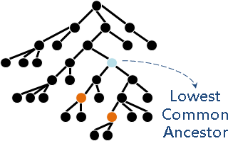
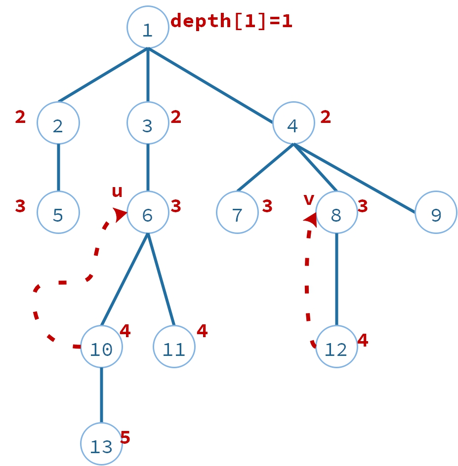
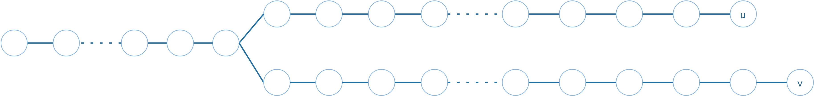

# LCA算法之倍增法

***

一个有$n$($n=13$)个节点的树,求任意两点的最近公共祖先（Lowest common ancestor）

## 最近公共祖先定义

<https://en.wikipedia.org/wiki/Lowest_common_ancestor>
<https://zh.wikipedia.org/wiki/最近公共祖先_(图论)>



以下图：


例如：
$LCA(13,11)=6$
$LCA(10,11)=6$
$LCA(5,11)=1$
$LCA(7,4)=4$  （**<font color=DarkRed>注意：节点也是自己的祖先</font>**）


## 朴素算法

$u=13,v=12,LCA(u,v)=?$

求$LCA(13,12)=?$

1. **<font color=DarkRed>计算节点深度：</font>** 从根节点深度搜索一次树，计算每一个节点的深度$depth[i]$，时间复杂度$O(n)$。


2. **<font color=DarkRed>平衡两点深度：</font>** 如果$depth[u] \neq depth[v]$，把深度比较大深的往上移动，使得$depth[u] = depth[v]$。时间复杂度$O(\mid p-q \mid)$,期中p，q表示这两个节点的深度。


把$u=13$ 这个点往上移动(往父节)，使得$u=10$。此时$depth[12] = 4,depth[12] = 4$。

3. **<font color=DarkRed>同时移动两点，直到相同：</font>** $u$,$v$每次同时往上移动一步，直到$u=v$,这时候就是LCA的答案，时间复杂度：$O(n)$ 如下图：

  

## 倍增算法

#### **<font color=DarkRed>思路</font>**


以上第2、3步骤，每次都移动一步。时间复杂度$O(\mid p-q \mid) + O(n)$。

还可以快一点。一口气移动m步。

1. 预先计算好每个节点的上一辈祖先，上两辈祖先，上四辈祖先，上八辈祖先，....，上$2^k$辈祖先，$k=\log_2(n)$;
2. 二分查找LCA;
2.1 辈分太高，超出根节点，可以设置祖先为根节点。
2.2 辈分太低，还是两个不同节点，未到达共同祖先，移动节点。

#### **<font color=DarkRed>说明</font>**

1. 寻找u,v的LCA


2. 移动v，使得u、v深度相同

```c++
void dfsDepth(int curr)
{
    visited[curr] = 1;
    //遍历curr的子节点
    for(auto next:tree[curr])
    {
        depth[next] = depth[curr] + 1;
        if (visited[next] == 0)
            dfsDepth(next);
    }
}

int main()
{
    int root=1;
    dfsDepth(root);
    return;
}

```


参考
http://www.csie.ntnu.edu.tw/~u91029/Tree.html#5