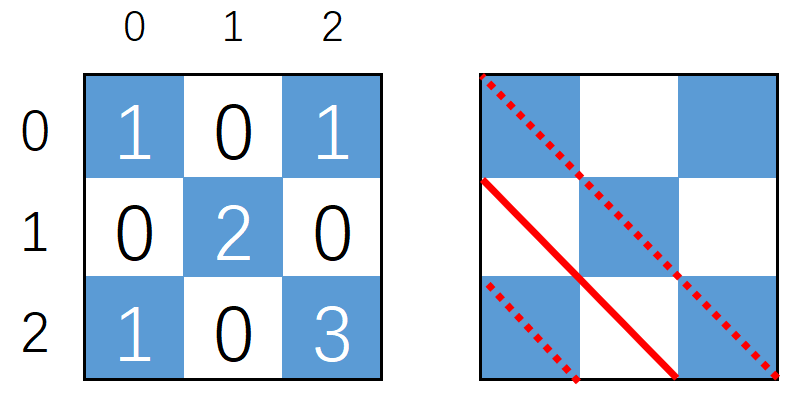

# Count the Cows 题解
USACO 2021 February Contest, Gold
Problem 3. Count the Cows

根据题目生成数据，发现在$3^i$长度的正方形内，称为$i$-维正方形A，奶牛位于正对角线和反对角线上的格子，如下红色和黄色部分。蓝色格子代表有奶牛，白色代表无奶牛。


$i$-维正方形作为整体一个正方形，又拓展为$i+1$维正方形B。B的对角线和反对角线分别是A。每个$i$-维正方形的对角线上的小正方形是$i-1$-维正方形。这样可以无限拓展下去。例如：

## 1维正方形
$ {3\times3 \rightarrow 1\times1} \Rightarrow {3^1\times3^1 \rightarrow 3^0\times3^0}$


## 2维正方形
$9\times9 \rightarrow 3\times3 \Rightarrow 3^2\times3^2 \rightarrow 3^1\times3^1$


## 3维正方形
$27\times27 \rightarrow 9\times9 \Rightarrow 3^3\times3^3 \rightarrow 3^2\times3^2$

$\Rightarrow 3^i \times 3^i \Rightarrow 3^{i-1} \times 3^{i-1}$


## 基础正方形 $3\times3 $


以下是以$(x,y)$为终点，在基础正方形$3\times3 $内，对角线经过蓝色格子的数量


## 对称性

对角线$(x,y,d)$表示线段$(x,y) \rightarrow (x+d,y+d) $，进观察发现：对角线蓝色格子数：$(x,y,d)=(y,x,d)$,如下图：


因此集中考虑黄色的区域，另外一半的区域可以转化成黄色区域的对角线


## 可叠加

如下图，对角线经过蓝色格子数量： 绿色$=$橙色$+$红色，因此
$ans_{x,y,d}=F_{x+d,y+d} - F_{x-1,y-1}$
$F_{x,y}$ 代表线段$A(0,y-x) \rightarrow B(x,y)$ 经过蓝色格子的数量


此时问题转换成：任意点(x,y)往对角线走，到左上边缘，经过蓝色格子的数量，如下图：


## 划分区域
$i$-维正方形在坐标$(0,3^{i-1})$处形成的对角线，不经过任何蓝色格子，$ans=0$。
在此处分割，分上、下两个区域，如下图红色区域和黄色区域。
- 黄色区域会经过$1$、$1+3$、$1+3+5$号蓝色格子
- 红色区域会经过$4$号蓝色格子


进一步细化，进观察以下图，点(x,y)在不同区域形成对角线：
- 在0区不经过任何蓝格子,$ans=0$
- 在1区会经过1号蓝格子
- 在3区会经过1+3号蓝格子
- 在5区会经过1+3+5号蓝格子
- 在4区会经过4号蓝格子


## 分治
- 对角线每经过一个正方形，都可拆分成最小单位的基础正方形$3\times3$，最终答案是由正方形 $3\times3$累加而得。
如下图：


- 如下图,很明显
$ans=ans1+ans3+ans5$
正方形1,3都是完整的穿越的，因此
$ans=2*ans1+ans5$
算法拆分2部分，先计算穿越完整的正方形答案再计算不完整的正方形答案


## 算法设计
- 令 $diff=y-x$
- 对角线$(0,diff) \rightarrow (x,y)$在多大$3^i$的正方形？
```cpp
    //对角线(0,y-x)->(x,y)在多大3^i的正方形？
    ill sqrLen(ill x, ill y)
    {
        ill max1 = max(x, y);
        ill r = 1ll;
        while (r <= max1)
            r *= 3ll;

        return r;
    }
```

- 以点$(0,diff)$为对角线，也就是说直线 $y=x+diff$ 在长度是$n(n=3^i,n>diff)$的正方形内经过多少个蓝色格子？$n$必须能包住对角线。
```cpp
ill sumCompleteBlueSqrCnt(ill diff, ill n)
```


- 情况一： 如果$n=1$或$n=3$

```cpp
if(n==1ll)
{
    return 1ll;
}    
else if(n==3ll)
{
    if(diff==0ll)
        return 3ll;
    else if(diff==1)
        return 0ll;
    else if(diff==2)
        return 1ll;
} 
```

- 情况二： $diff < \frac{n}{3}$,穿过$1,3,5 == 3 \times1$


```cpp
    n /=3ll;
    if (diff < n)   //情况二：x<y<n,穿过1,3,5
    {
        return 3ll * sumCompleteBlueSqrCnt(diff, n);
    }
```

- 情况三： $diff = \frac{n}{3}$,穿过空白格子

```cpp
    n /=3ll;
    ...
    else if(diff==n)    //情况三：穿过空白格子
    {
        return 0ll;
    } 
```

- 情况四： $\frac{n}{3} < diff  < 2\times n$,穿过4号格子。处理办法：等同于在1号格子对角线的上部。计算走几步到达4号正方形，计算x,y坐标再递归调用情况二。


```cpp
    n /=3ll;
    ...
    else if (diff < 2*n) //情况四：穿过4号格子，等同于在1号格子对角线的上部。计算走几步到达4号正方形，计算x,y坐标再递归调用情况二。
    {
        ill x1 = (2ll * n - diff);
        ill y1 = 0ll;
        if (x1 > y1)
            swap(y1, x1);

        return sumCompleteBlueSqrCnt(y1 - x1, n);
    }
```
- 情况五：等同情况一，穿过4号格子，处理办法：等同于在1号格子对角线或者对角线的下部

```cpp
    n /=3ll;
    ...

    else        //情况五：等同情况一，穿过4号格子，处理办法：等同于在1号格子对角线或者对角线的下部
    {
        return sumCompleteBlueSqrCnt(diff % n, n);
    }
```
- 完整sumCompleteBlueSqrCnt代码
```cpp
    //在长度是n的正方形内，(0,diff) 开始的对角线，在n长度的正方形经过了多少个蓝色格子
    ill sumCompleteBlueSqrCnt(ill diff, ill n)
    {
        //情况一：
        if(n==1ll)
        {
            return 1ll;
        }
        else if(n==3ll)
        {
            if(diff==0ll)
                return 3ll;
            else if(diff==1)
                return 0ll;
            else if(diff==2)
                return 1ll;
        }   
        
        n /=3ll;
        if (diff < n)   //情况二：x<y<n,穿过1,3,5
        {
            return 3ll * sumCompleteBlueSqrCnt(diff, n);
        }
        else if(diff==n)    //情况三：穿过空白格子
        {
            return 0ll;
        }        
        else if (diff < 2*n) //情况四：穿过4号格子
        {
            ill x1 = (2ll * n - diff);
            ill y1 = 0ll;
            if (x1 > y1)
                swap(y1, x1);

            return sumCompleteBlueSqrCnt(y1 - x1, n);
        }
        else        //情况五：等同情况一，穿过4号格子，处理办法：等同于在1号格子对角线或者对角线的下部
        {
            return sumCompleteBlueSqrCnt(diff % n, n);
        }
    }
```
```cpp
    //在长度是n的正方形内，线段(0,y-x)->(x,y)经过了多少个蓝色格子
    ill sumAllBlueSqrCnt(ill x, ill y, ill n)
    {
        if (x > y)
            swap(x, y);

        if (n == 1)
            return 1ll;
        else if (n == 3ll)
            return baseSqr[x][y];

        ill topLeftSquareLen = n / 3ll; //左上角正方形大小3^(i-1)

        if (y < topLeftSquareLen) //图一
        {
            return sumAllBlueSqrCnt(x, y, topLeftSquareLen);
        }
        else if (x < topLeftSquareLen) 
        {
            if (y < x+ topLeftSquareLen) //图二
            {
                return sumCompleteBlueSqrCnt(y-x, topLeftSquareLen);
            }
            else if (y >= x + topLeftSquareLen && y < 2ll * topLeftSquareLen) //图三
            {
                return 0ll;
            }
            else  //图五  ,y >= 2ll * topLeftSquareLen
            {
                return sumAllBlueSqrCnt(x, y%topLeftSquareLen, topLeftSquareLen);
            }

        }
        else if (y == x + topLeftSquareLen) //图四
        {
            return 0ll;
        }
        else if (x < 2ll*topLeftSquareLen) 
        {
            if (y < 2ll * topLeftSquareLen) //图六 
            {
                return sumCompleteBlueSqrCnt(y-x, topLeftSquareLen) + sumAllBlueSqrCnt(x%topLeftSquareLen, y%topLeftSquareLen, topLeftSquareLen);
            }
            else if (y < x + topLeftSquareLen) //图七
            {
                return 2ll*sumCompleteBlueSqrCnt(y-x, topLeftSquareLen);
            }
            else  //图八  
            {
                ill y1=2ll*topLeftSquareLen;
                ill x1=x-(y-y1);
                y1 %=topLeftSquareLen;
                x1 %=topLeftSquareLen;
                if(x1>y1)
                    swap(x1,y1);
                
                return sumCompleteBlueSqrCnt(y1-x1, topLeftSquareLen);
                
            }
        }
        else        //图九
        {
            return 2ll*sumCompleteBlueSqrCnt(y-x, topLeftSquareLen)+sumAllBlueSqrCnt(x%topLeftSquareLen, y%topLeftSquareLen, topLeftSquareLen);
        }
    }
```


